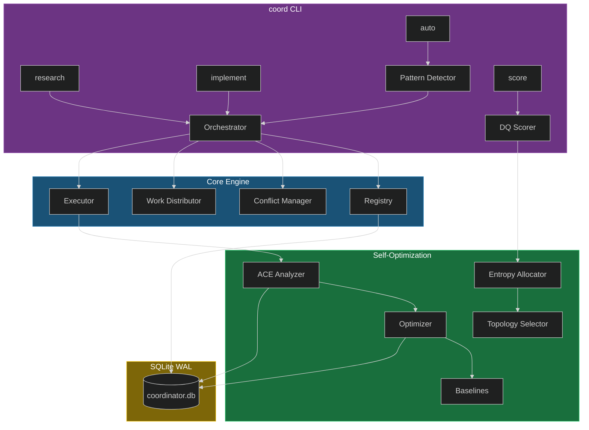

<p align="center">
  
</p>

<p align="center">
  <a href="#install"></a>
  
  
  
  
</p>

<p align="center">
  <b>The only multi-agent coordinator that learns from its own execution history.</b><br/>
  DQ-scored routing • ACE consensus • entropy-guided allocation • research-driven self-optimization
</p>

---

## What Is This?

A pip-installable Python package that coordinates multiple AI agents to solve complex tasks — and **gets better at it over time**. Built on 64 research papers (Agyn, EGSS, W&D, Spectral Guardrails) and proven infrastructure with 3,039+ routing decisions at 93.1% accuracy.

**Key differentiator:** No other coordination tool learns from its own execution history via DQ-scored adaptive consensus.

## Architecture



## Install

```bash
pip install antigravity-coordinator
```

Or for development:

```bash
git clone https://github.com/Dicoangelo/antigravity-coordinator.git
cd antigravity-coordinator
pip install -e ".[dev]"
```

## Quick Start

```bash
# Initialize database and config
coord init

# Coordination strategies
coord research "Understand the caching architecture"     # 3 parallel explore agents
coord implement "Add retry logic to the API client"      # Parallel builders + file locks
coord review "Refactor the authentication module"        # Builder + reviewer concurrent
coord full "Design and build a notification system"      # Research → Build → Review pipeline
coord team "Comprehensive API overhaul"                  # Opus 4.6 agent team

# Auto-detect best strategy
coord auto "Fix the bug in the login flow"               # Pattern detection → strategy selection

# DQ Scoring
coord score "Design a distributed caching system"        # Score complexity, route to model

# Monitoring
coord status                                             # Active agents and state
coord history                                            # Session outcomes with DQ scores

# Self-optimization
coord optimize --dry-run                                 # Propose baseline improvements
coord optimize --apply                                   # Apply validated improvements
```

## Modules

| Module | Purpose |
|--------|---------|
| `coordinator.engine` | Orchestrator, registry, distribution, conflict resolution, executor |
| `coordinator.strategies` | Research (3 parallel), implement, review, full, team |
| `coordinator.scoring` | DQ scorer (Python), complexity analyzer, Opus 4.6 thinking tiers |
| `coordinator.optimization` | Entropy allocator (EGSS), topology selector (Agyn), pattern detector |
| `coordinator.feedback` | ACE analyzer (6 agents + consensus), self-optimizer with rollback |
| `coordinator.safety` | Guardrails: cost budgets, time limits, scope boundaries, heartbeat |
| `coordinator.storage` | SQLite WAL, 7 tables, migrations |
| `coordinator.api` | FastAPI server with 6 endpoints + SSE streaming |

## DQ Scoring

Every routing decision is scored with the Decision Quality (DQ) framework:

```
DQ = Validity (35%) + Specificity (25%) + Correctness (40%)
```

```bash
$ coord score "Design a distributed caching system"

Query:      Design a distributed caching system
Complexity: 0.850
Model:      opus
Thinking:   high
DQ Score:   0.789 (V:0.97 S:1.00 C:0.50)
Cost est:   $0.013000
```

## Self-Optimization Loop

```
Session → ACE Analysis → Pattern Detection → Baseline Update → Better Routing
    ↑                                                              ↓
    └──────────────────── Feedback Loop ───────────────────────────┘
```

After 50+ sessions, the coordinator:
1. Calculates optimal complexity thresholds from outcome data
2. Proposes baseline updates when confidence > 75%
3. Auto-applies improvements that beat holdout accuracy by >5%
4. Rolls back if any metric drops >10%

## API Server

```bash
coord-api --port 3848
```

| Endpoint | Method | Purpose |
|----------|--------|---------|
| `/api/health` | GET | Health check + uptime |
| `/api/coordinate` | POST | Start coordination session |
| `/api/status` | GET | Active agents |
| `/api/history` | GET | Session outcomes |
| `/api/metrics` | GET | DQ trends + accuracy |
| `/api/stream` | GET | SSE real-time updates |

## Research Lineage

Built on insights from 64 papers analyzed in a structured research session:

| Paper | Innovation Applied |
|-------|--------------------|
| **Agyn** (72.2% SWE-bench) | Dynamic agent topology selection |
| **W&D** (Write & Dispatch) | Parallel tool calling optimization |
| **EGSS** | Entropy-guided search scaling — spend compute where uncertainty is highest |
| **Spectral Guardrails** | Safety constraints that don't kill performance |
| **RC-GRPO** | Reward-conditioned group preference optimization |

## Quality

```
pytest tests/        → 133/133 passed (0.55s)
ruff check src/      → All checks passed
ruff format --check  → 31 files formatted
mypy src/ --strict   → No issues found
```

## License

MIT

<p align="center">
  
</p>
